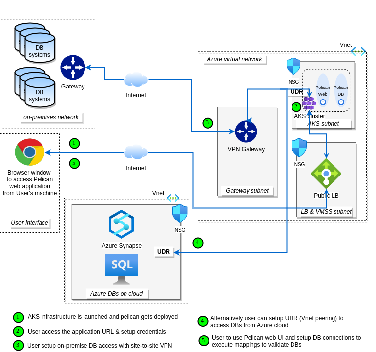

# **Pelican launch on Azure cloud services**

### **OVERVIEW**
Datametica intends to bring its suite of products starting with the Pelican Data Verification product to the cloud marketplace. We have implemented support to launch and use Pelican over Kubernetes and can be integrated with Azure's AKS service

### **DIRECTORY STRUCTURE**

```
├── chart
│   └── pelican     <-- Pelican helm charts to deploy on AKS
├── deploy          <-- ARM template to create AKS infra for Pelican deployment
├── README.md
└── resources       
```

### **DEPLOYMENT ARCHITECTURE**



Pelican integrates well with AKS as show in above achitecture diagram and accelerates the data validation process between source and destination data bases and performs automated data validations.

Kubernetes manages Pelican single-instance solutions and the Pelican UI endpoints by default exposed externally using a LoadBalancer Service on a single port 8080 - for HTTP interface. The MySQL DB is exposing the service on port 3306 internally to pelican POD.

The sizing and configuration can be customized and managed using ConfigMaps and Helm chart values.yml

## **INSTALLATION**

### Pre-requisites for deployment of Pelican Application

* Azure-CLI
* Kubectl utility
* Helm utility
* Docker 
* Python3
* An Azure account with permissions to create an AKS cluster and Push/Pull images to an ACR

### Steps for running Pelican(BYOL) on AKS via Deployment script:

Before running the deployment script, make sure:

* You have all the Pre-requisites covered.

* You have provided values of all the arguments required by the deployment script.

* You have subscribed to Azure Pelican Offer from Marketplace and provided that image repo name and tag to the deployment script as arguments.
&nbsp;
##### **Deployment script Argument descriptions**:
&nbsp;

| Argument | Description |
| ------ | ------ |
| username | Username for Azure cloud account |
| git_url | Git URL for Pelican Artifacts |
| subscriptionID | Azure SubscriptionID to use |
| resourcegroup | Azure ResourceGroup to use |
| registryname | Azure registry to use for pushing Pelican DB image |
| registryusername | Azure registry admin username to use for pushing Pelican DB image |
| registrypassword | Azure registry admin password to use for pushing Pelican DB image |
| loadbalancerrange | Loadbalancer range to allow Pelican access to. Eg. 52.43.31.82/32 |
| dbpassword | Pelican DB password (pelicanuser) | 
| imagename | Pelican image full qualified name obtained after Pelican offer subscription from Azure Marketplace |
| imagetag | Pelican image tag obtained after Pelican offer subscription from Azure Marketplace |
| virtualNetworkNewOrExisting | Choose if (new/existing) VNet to be used for Pelican Deployment |
| virtualNetworkName | Provide the name of Virtual Network |
| virtualNetworkAddressPrefix | Provide the Virtual Network address space |
| subnetName | Provide the subnet name |
| subnetAddressPrefix | Provide the Virtual subnet address space |

##### Execution steps:

* Clone this github repo
```
git clone https://github.com/datametica/AzureMarketplace.git
```

* Run the following deployment script command to get the help 
```
python3 deployment.py -h
```

*please note: The script needs few argumats to run the complete deployment. Please refer argument description table or the help message from above command* 

* After deciding all the inputs that required to run the deployment script, execute the deployment script. Below is the sample example
```
python3 deployment.py --username john.doe@microsoft.com  \
        --git_url https://github.com/projects/AzureMarketplace.git \
        --subscriptionID 21e87802-e43e-4149-9921-90971c45638c \
        --resourcegroup Datametica_Product_RG \
        --virtualNetworkNewOrExisting new \
        --virtualNetworkName PelicanVnet \
        --virtualNetworkAddressPrefix 172.26.10.0/24 \
        --subnetName Pelican-Subnet \
        --subnetAddressPrefix 172.26.10.0/25 \
        --registryname sampleRegistry \
        --registryusername sampleRegistry \
        --registrypassword fehipfpwhhwphdqfphfwcjo \
        --loadbalancerrange 52.43.31.82/32 \
        --dbpassword pelicanuser@123 \ 
        --imagename sampleRegistry.azurecr.io/pelicanbyol \
        --imagetag 1.0.1
```

#### **Note** 
****

In case the pod launch fails due to some misconfiguration of values in helm chart or error in deployment, please rerun the deployment script with appropriate changes in the helm and script values and making sure all the steps were followed as provided. 

Once you will re-run the deployment script, provide the appropriate values asked and when prompted, choose to clean up the old version of helm and install a fresh version.

****
&nbsp;
### Steps for running Pelican(BYOL) on AKS via Manual steps:

In order to deploy Pelican, we will require an AKS cluster. We can use an existing cluster or create a new one. Steps for creating a new cluster are as given below:

#### Setting up an AKS cluster

1\. In order to interact with Azure using command line, we will have to use Azure cloud shell or install az-cli package on our local system. 

Refer below provided link to download Azure CLI on local system:

**https://docs.microsoft.com/en-us/cli/azure/install-azure-cli**

2\. Login into your azure account using command if using AZ CLI on local system:

```sh
az login
```

3\. If you have multiple Azure subscriptions, set the desired subscription to run the application using following command:

```sh 
az account set --subscription [SubscriptionID/SubscriptionName]
```

4\. Clone the git repository to the environment you are using for setup:

```sh
git clone [git_url]
```

5\. Change the directory to switch to the “pelican” directory in the cloned repository. Provide appropriate virtual networking details in the "**azuredeploy.parameters.json**" file under "**deploy**" directory. You can either use an existing vnet or create a new one by changing the value of parameter “**virtualNetworkNewOrExisting**” to either “**existing**” or “**new**”. 

6\. Finally, Run the below command to set up AKS cluster:

```sh
az deployment group create --name [DeploymentName] --resource-group [ResourceGroupName] --template-file deploy/azuredeploy.json --parameters deploy/azuredeploy.parameters.json --parameters resourceName=[PelicanClusterName]
```


#### **Note** 
****
Please provide the deployment and an existing resource-group name in the above command. In case you need to access any internal applications or databases, please use the resource group with Azure VPN setup in order to let Pelican communicate with internal applications.
****

Above steps will ensure that you have a new AKS Cluster to deploy the pelican application.
&nbsp;
&nbsp;
#### Steps for deploying Pelican application on AKS cluster using Helm Charts:

In order to deploy Pelican using Helm charts, we will require docker images packaging the application. To get the images, we will need to subscribe to the Azure Marketplace Offer for Pelican. Below are the steps for same:

1\. Go to Azure portal and search for Azure Marketplace.

2\. Search for "Pelican" in "Data Analytics" section or directly search for “Pelican” in Azure Marketplace.

3\. Click on "**Get it now**" or "**Purchase**".

4\. Provide the necessary details asked in the UI.

Once the offer subscription is successful, you will be able to see the docker images in the defined container registry in the offer.
#### **Note** 
****
This is a BYOL solution which requires a valid license to use. You are responsible for purchasing and managing your own licenses from Datametica. Request a license https://www.datametica.com/contact-us/ or sales.pelican@datametica.com
****
&nbsp;
##### Updating Helm charts:
&nbsp;
Now edit the “**values.yaml**” file present in the Helm charts in “**chart**” directory of cloned git repo.

Provide the image repo name and tag in the “**image**” section under container name **pelican** in the Helm charts using the images provided by the Azure Pelican offer subscription.

For example:

```sh
pelican:
  replicas: 1
  image:
    repo: "sampleRegistry.azurecr.io/datameticasolutionsprivatelimited1595414718157/pelican-byol/pelican"
    tag: "latest"
  namespace: "default"
```
&nbsp;
##### Steps for building and hosting Pelican DB image on Azure cloud
&nbsp;
Build the Pelican DB image using the following command from pelican directory:  
```sh
docker build -t [IMAGE_TAG] .
```
Now, change the docker image tag of built image so that we can push it to the private Azure Container Registry using the following command:
```sh
docker tag [IMAGE_TAG] [containerRegistryName].azurecr.io/[Repo_Name]:[Version]
```
For example:
****
Assuming,
&nbsp;
The private Azure Container Registry is 'sampleRegistry' 
Repository name is 'pelican'
Version is 'v1'
IMAGE_TAG that you gave is 'pelicanTestImage',
&nbsp;
The command would be:
```sh
docker tag  pelicanTestImage:latest  sampleRegistry.azurecr.io/pelican:v1
```
****
&nbsp;
Now log in to the Azure container registry so that the image can be pushed using the following command:
```sh
docker login [containerRegistryName].azurecr.io -u 00000000-0000-0000-0000-000000000000 -p $(az acr login -n [containerRegistryName] --expose-token 2> /dev/null | awk -F '\"' 'NR==2 {print $4}')
```
Now push the image into the Azure container registry using the following command:
```sh
docker push [containerRegistryName].azurecr.io/[Repo_Name]:[Version]
```
&nbsp;
Provide the image repo name and tag in the “**image**” section under container name **pelicandb** in the Helm charts using the image built by the Dockerfile for DB image. The DB image should also be hosted in the same container registry as pelican image else it would require creation and configuration of additional kubernetes secrets for pulling image from another private registry. 
&nbsp;
##### Reference configuration:
&nbsp;
```sh
pelicandb:
  replicas: 1
  image:
    repo: "sampleRegistry.azurecr.io/pelicandb"
    tag: "latest"
  port: 3306
  service:
    annotations: {}
    type: ClusterIP
    targetPort: 3306
  password: "SomeStrongPassword"
```
The **password** field in last line of above configuration is for setting the password that will be used for **pelicanuser** for mysql database configuration.

MySQL will also require a root password to be set by default in order to start up and do necessary configurations and changes to the database. Therefore, provide the MySQL root password under **templates** section in the **charts** directory in the **pelicandb-statefulset.yaml** file. 

Reference configuration:

```sh
    spec:
      containers:
      - name: pelican-db
        image: "{{ .Values.pelicandb.image.repo }}:{{ .Values.pelicandb.image.tag }}"
        imagePullPolicy: Always
        env:
          - name: MYSQL_ROOT_PASSWORD
            value: YOUR_PASSWORD_HERE
```
 
&nbsp;
 
Then, provide the value for “**loadBalancerSourceRanges**” in the helm charts under “**service**” section.

The value of the field should be any subnet range from which the application should be accessible.

**For example:** “52.63.11.82/32”.

It can also be set to “0.0.0.0/0” to allow all inbound traffic on the load-balancer listener port.

Finally run the following commands in “pelican” directory of cloned git repository on the CLI to deploy the application:

```sh
 az aks get-credentials --resource-group [ResourceGroupName] --name [cluster-name];
```

```sh
kubectl create secret docker-registry acr-secret --namespace default --docker-server=[ContainerRegistryName].azurecr.io --docker-username=[RegistryAdminUsername] --docker-password=[RegistryAdminPassword]
```
```sh
helm install pelican chart/
```
&nbsp;
#### **Note**

****

The secret should be created in same environment from where the helm charts will be deployed.

Container Registry admin username and password needs to be enabled and are found under “Access Keys” setting in the Container Registry.

**[cluster-name]** will be the name of AKS cluster in which application is to be deployed. In case of new cluster creation using ARM template in current git repo, the cluster name will be: **Pelican-cluster**.
****

The above commands will successfully install the Pelican application on the mentioned cluster.
&nbsp;
&nbsp;
## Accessing Pelican Application UI

1\. On Azure portal, open the Azure cloud shell.

2\. Enter the below commands:

```sh
az aks get-credentials --resource-group [resource-group-name] --name [cluster-name];
```
```sh
kubectl get svc
```
After running the above command, you will get the LoadBalancer IP address and port number to launch the Pelican application from a web browser with appropriate network configurations (in case of VPN).
