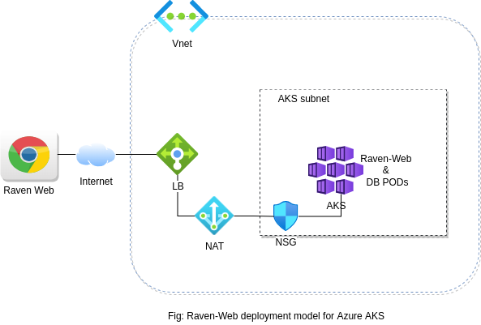

## **Raven with BYOL on Azure marketplace**

### Overview

Datametica intends to bring its suite of migration automation products starting with Datametica's Raven - an automated SQL and ETL translation product to the Azure marketplace. We have implemented support to launch and use Raven over Kubernetes and can be integrated with Azure's AKS as a Kubernetes app with the marketplace.

### EKS Deployment architecture
Raven can be deployed using helm charts on AKS, the deployment architecture will look like as below



Raven on AKS accelerates the SQL and ETL translation process from legacy source systems to cloud-native technology. 

Kubernetes manages Raven single-instance solutions and the Raven UI endpoints by default exposed externally using a LoadBalancer Service on a single port 8080 or 8443 - for HTTP and HTTPS interface.

The sizing and configuration can be customized and managed using ConfigMaps and Helm chart values.yml

The Raven AKS version adapts brings your own license pricing model and one can connect with Datametica on support.raven@datametica.com or sales.raven@datametica.com or info@datametica.com for licensing.

**Prerequisites**
 
* Azure-CLI
* Kubectl utility
* Helm utility
* Docker
* Python3
* An Azure account with permissions to create an AKS cluster and Push/Pull images to an ACR
 
### Steps for running Raven (BYOL) on AKS via Deployment script:

Before running the deployment script, make sure:

* You have all the Pre-requisites covered.

* You have provided values of all the arguments required by the deployment script.

* You have subscribed to Azure Raven Offer from Marketplace and provided that image repo name and tag to the deployment script as arguments.
&nbsp;
##### **Deployment script Argument descriptions**:
&nbsp;

| Argument | Description |
| ------ | ------ |
| username | Username for Azure cloud account |
| git_url | Git URL for Raven Artifacts |
| subscriptionID | Azure SubscriptionID to use |
| resourcegroup | Azure ResourceGroup to use |
| registryname | Azure registry to use for pushing Raven DB image |
| registryusername | Azure registry admin username to use for pushing Raven DB image |
| registrypassword | Azure registry admin password to use for pushing Raven DB image |
| loadbalancerrange | Loadbalancer range to allow Raven access to. Eg. 52.43.31.82/32 |
| dbpassword | Raven DB password |
| imagename | Raven image full qualified name obtained after Raven offer subscription from Azure Marketplace |
| imagetag | Raven image tag obtained after Raven offer subscription from Azure Marketplace |
| virtualNetworkNewOrExisting | Choose if (new/existing) VNet to be used for Raven Deployment |
| virtualNetworkName | Provide the name of Virtual Network |
| virtualNetworkAddressPrefix | Provide the Virtual Network address space |
| subnetName | Provide the subnet name |
| subnetAddressPrefix | Provide the Virtual subnet address space |
</tbody>
</table>

##### Execution steps:

* Clone this github repo
```
git clone https://github.com/datametica/AzureMarketplace.git
```

* Run the following deployment script command to get the help
```
python3 raven-deployment.py -h
```
*please note: The script needs few argumats to run the complete deployment. Please refer argument description table or the help message from above command*

* After deciding all the inputs that required to run the deployment script, execute the deployment script. Below is the sample example
```
python3 raven-deployment.py --username john.doe@microsoft.com  \
        --git_url https://github.com/projects/AzureMarketplace.git \
        --subscriptionID 21e87802-e43e-4149-9921-90971c45638c \
        --resourcegroup Datametica_Product_RG \
        --location useast2
        --virtualNetworkNewOrExisting new \
        --virtualNetworkName RavenVnet \
        --virtualNetworkAddressPrefix 172.26.10.0/24 \
        --subnetName Raven-Subnet \
        --subnetAddressPrefix 172.26.10.0/25 \
        --registryname sampleRegistry \
        --registryusername sampleRegistry \
        --registrypassword fehipfpwhhwphdqfphfwcjo \
        --loadbalancerrange 52.43.31.82/32 \
        --dbpassword raven@123 \
        --imagename sampleRegistry.azurecr.io/ravenbyol \
        --imagetag 1.0.1
```

#### **Note** 
****

In case the pod launch fails due to some misconfiguration of values in helm chart or error in deployment, please rerun the deployment script with appropriate changes in the helm and script values and making sure all the steps were followed as provided. 

Once you will re-run the deployment script, provide the appropriate values asked and when prompted, choose to clean up the old version of helm and install a fresh version.

****
&nbsp;
### Steps for running Raven(BYOL) on AKS via Manual steps:

In order to deploy Raven, we will require an AKS cluster. We can use an existing cluster or create a new one. Steps for creating a new cluster are as given below:

#### Setting up an AKS cluster

1\. In order to interact with Azure using command line, we will have to use Azure cloud shell or install az-cli package on our local system. 

Refer below provided link to download Azure CLI on local system:

**https://docs.microsoft.com/en-us/cli/azure/install-azure-cli**

2\. Login into your azure account using command if using AZ CLI on local system:

```sh
az login
```

3\. If you have multiple Azure subscriptions, set the desired subscription to run the application using following command:

```sh 
az account set --subscription [SubscriptionID/SubscriptionName]
```

4\. Clone the git repository to the environment you are using for setup:

```sh
git clone [git_url]
```

5\. Change the directory to switch to the “raven” directory in the cloned repository. Provide appropriate virtual networking details in the "**azuredeploy.parameters.json**" file under "**deploy**" directory. You can either use an existing vnet or create a new one by changing the value of parameter “**virtualNetworkNewOrExisting**” to either “**existing**” or “**new**”. 

6\. Finally, Run the below command to set up AKS cluster:

```sh
az deployment group create --name [DeploymentName] --resource-group [ResourceGroupName] --template-file deploy/azuredeploy.json --parameters deploy/azuredeploy.parameters.json --parameters resourceName=[RavenClusterName]
```

****

Above steps will ensure that you have a new AKS Cluster to deploy the raven application.
&nbsp;
&nbsp;
#### Steps for deploying Raven application on AKS cluster using Helm Charts:

In order to deploy Raven using Helm charts, we will require docker images packaging the application. To get the images, we will need to subscribe to the Azure Marketplace Offer for Raven. Below are the steps for same:

1\. Go to Azure portal and search for Azure Marketplace.

2\. Search for "Raven" in "Data Analytics" section or directly search for “Raven” in Azure Marketplace.

3\. Click on "**Get it now**" or "**Purchase**".

4\. Provide the necessary details asked in the UI.

Once the offer subscription is successful, you will be able to see the docker images in the defined container registry in the offer.
#### **Note** 
****
This is a BYOL solution which requires a valid license to use. You are responsible for purchasing and managing your own licenses from Datametica. Request a license https://www.datametica.com/contact-us/ or sales.raven@datametica.com
****
&nbsp;
##### Updating Helm charts:
&nbsp;
Now edit the “**values.yaml**” file present in the Helm charts in “**chart**” directory of cloned git repo.

Provide the image repo name and tag in the “**image**” section under container name **raven** in the Helm charts using the images provided by the Azure Raven offer subscription.

For example:

```sh
ravendb:
  image:
    repo: "sampleRegistry.azurecr.io/datameticasolutionsprivatelimited1595414718157/raven-byol/ravendb"
    tag: "9.6"
  password: ""
  user: "postgres"
raven:
  replicas: 1
  image:
    repo: "sampleRegistry.azurecr.io/datameticasolutionsprivatelimited1595414718157/raven-byol/raven"
    tag: "latest"
  namespace: "default"
```
The **password** field in line of above configuration is for setting the password that will be used for **postgres** for pgsql database configuration.
&nbsp;
 
Then, provide the value for “**loadBalancerSourceRanges**” in the helm charts under “**service**” section.

The value of the field should be any subnet range from which the application should be accessible.

**For example:** “52.63.11.82/32”.

It can also be set to “0.0.0.0/0” to allow all inbound traffic on the load-balancer listener port.

Finally run the following commands in “raven” directory of cloned git repository on the CLI to deploy the application:
```sh
 az aks get-credentials --resource-group [ResourceGroupName] --name [cluster-name];
```

```sh
kubectl create secret docker-registry azure-secret --namespace default --docker-server=[ContainerRegistryName].azurecr.io --docker-username=[RegistryAdminUsername] --docker-password=[RegistryAdminPassword]
```

```sh
helm install raven chart/
```
&nbsp;
#### **Note**

****

The secret should be created in same environment from where the helm charts will be deployed.

Container Registry admin username and password needs to be enabled and are found under “Access Keys” setting in the Container Registry.

**[cluster-name]** will be the name of AKS cluster in which application is to be deployed. In case of new cluster creation using ARM template in current git repo, the cluster name will be: **Raven-cluster**.
****

The above commands will successfully install the Raven application on the mentioned cluster.
&nbsp;
&nbsp;
## Accessing Raven Application UI

1\. On Azure portal, open the Azure cloud shell.

2\. Enter the below commands:

```sh
az aks get-credentials --resource-group [resource-group-name] --name [cluster-name];
```
```sh
kubectl get svc
```
After running the above command, you will get the LoadBalancer IP address and port number to launch the Raven application from a web browser with appropriate network configurations (in case of VPN).


